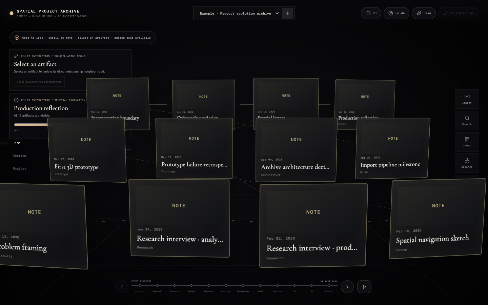
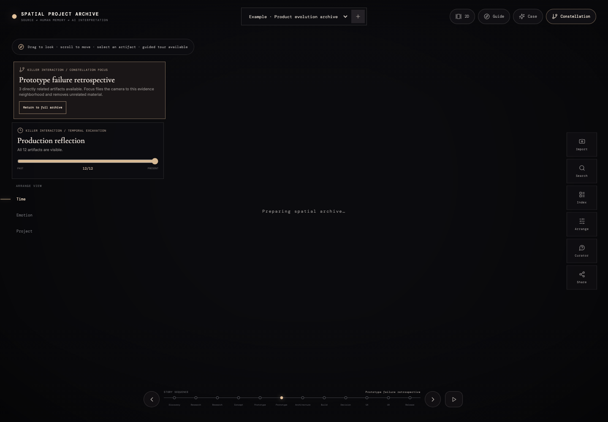
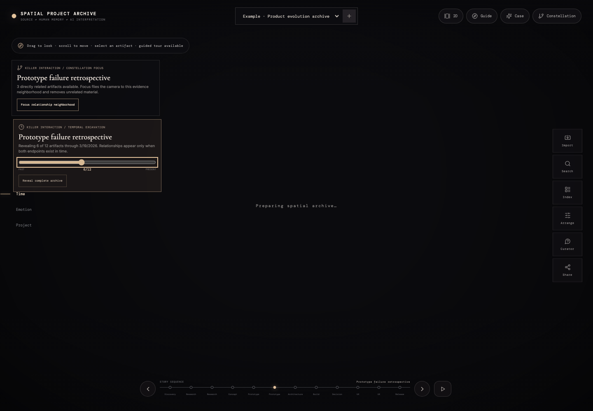
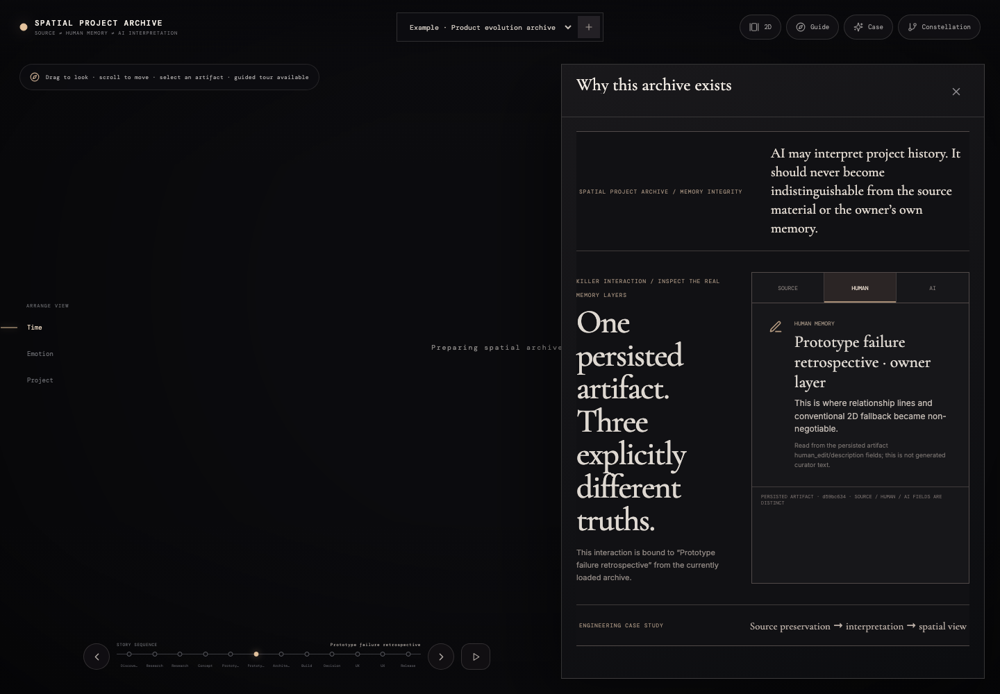

# Spatial Project Archive

**A full-stack project archive for preserving source material, human memory, AI interpretation, relationships, and spatial project history without collapsing them into one generated story.**  
**원문 자료, 사람의 기억, AI 해석, 관계, 공간적 프로젝트 히스토리를 하나의 생성형 이야기로 덮어쓰지 않고 보존하는 풀스택 프로젝트 아카이브입니다.**

**Live demo / 라이브 데모:** https://memory.oosu.dev/

## Overview / 개요

Spatial Project Archive asks: **can AI interpret project history without becoming indistinguishable from the source material or the owner's own memory?** Original files and provenance remain primary; human notes, curator interpretation, relationships, timelines, and spatial layouts are separate reversible layers.

Spatial Project Archive는 **AI가 프로젝트 역사를 해석하면서도 원문 자료나 사용자의 실제 기억과 구분되지 않는 상태를 피할 수 있는가?**를 다룹니다. Original File과 Provenance를 우선 보존하고 Human Note, Curator Interpretation, Relationship, Timeline, Spatial Layout은 분리된 reversible layer로 유지합니다.

A fresh deployment opens a persisted **Example · Product evolution archive** with 12 synthetic artifacts, multiple project phases, human notes, curator interpretations, relationships, and a saved spatial layout instead of a nearly empty archive.

첫 방문에는 거의 비어 있는 Archive 대신 12개의 synthetic artifact, 여러 project phase, human note, curator interpretation, relationship, saved spatial layout을 포함한 **Example · Product evolution archive**가 실제 backend에 저장되어 열립니다.

## Example archive / 예시 아카이브



The sample follows a project from problem framing and research through prototype failure, architecture decisions, implementation, onboarding redesign, spatial lenses, and production reflection.

예시 Archive는 Problem Framing과 Research에서 시작해 Prototype Failure, Architecture Decision, Implementation, Onboarding Redesign, Spatial Lens, Production Reflection까지 하나의 프로젝트가 변화하는 과정을 보여줍니다.

## Core interactions / 핵심 인터랙션

### Constellation Focus / 관계 집중 탐색

Select an artifact and isolate only its direct relationship neighborhood. The camera reframes the connected evidence cluster and unrelated artifacts disappear from the active scene.

Artifact 하나를 선택하면 직접 연결된 relationship neighborhood만 남기고 카메라를 해당 evidence cluster 중심으로 재구성합니다. 관련 없는 artifact는 active scene에서 제외됩니다.



### Temporal Excavation / 시간축 발굴

The temporal scrubber reveals the archive from past to present. Relationships appear only after both endpoints exist, so the scene shows how project context accumulated rather than only the final arrangement.

Temporal scrubber를 움직이면 Archive가 과거에서 현재 순으로 드러납니다. Relationship도 양쪽 artifact가 모두 존재하는 시점부터 나타나기 때문에 최종 배치가 아니라 프로젝트 context가 쌓이는 과정을 볼 수 있습니다.



### Source / Human / AI layers / 원문·사람·AI 레이어

The same persisted artifact can be switched between **Source Record**, **Human Memory**, and **AI Interpretation**. Missing interpretation stays visibly missing rather than being filled with plausible text.

동일한 persisted artifact를 **Source Record**, **Human Memory**, **AI Interpretation** 세 레이어로 전환할 수 있습니다. 해석이 없다면 그 상태를 그대로 보여주며 그럴듯한 텍스트로 자동 보완하지 않습니다.



## Architecture & Topics / 아키텍처 및 주제

### Architecture / 아키텍처

```text
Files / URLs / Notes
  ↓
Ingestion + SHA-256 duplicate handling
  ↓
MinIO object storage ── original binaries / derivatives
  ↓
PostgreSQL archive domain ── metadata / provenance / relationships / privacy
  ↓
Human notes + Curator suggestions ── separate interpretation layers
  ↓
Search / 2D / Timeline / Spatial representations
```

- **Frontend:** React, TypeScript, React Three Fiber, Drei, postprocessing, Motion.
- **Backend:** FastAPI, PostgreSQL metadata, MinIO object storage, ffmpeg/Poppler derivatives.
- **Archive domain:** artifacts, provenance, privacy, relationships, exhibition versions, spatial positions.
- **Interpretation boundary:** source, human-authored memory, and curator/AI interpretation remain separate fields.

- **프론트엔드:** React, TypeScript, React Three Fiber, Drei, postprocessing, Motion.
- **백엔드:** FastAPI, PostgreSQL metadata, MinIO object storage, ffmpeg/Poppler derivative 처리.
- **아카이브 도메인:** Artifact, Provenance, Privacy, Relationship, Exhibition Version, Spatial Position.
- **해석 경계:** Source, Human-authored Memory, Curator/AI Interpretation을 서로 다른 field로 유지합니다.

### Topics / 주제

[`digital-archive`](https://github.com/topics/digital-archive) · [`knowledge-management`](https://github.com/topics/knowledge-management) · [`provenance`](https://github.com/topics/provenance) · [`spatial-ui`](https://github.com/topics/spatial-ui) · [`human-in-the-loop`](https://github.com/topics/human-in-the-loop) · [`react-three-fiber`](https://github.com/topics/react-three-fiber) · [`fastapi`](https://github.com/topics/fastapi) · [`postgresql`](https://github.com/topics/postgresql) · [`minio`](https://github.com/topics/minio)

## Working flow / 작업 흐름

```text
Create/open archive / Archive 생성·열기
→ import files, URLs or notes / 파일·URL·Note 가져오기
→ process previews & metadata / Preview·Metadata 처리
→ review provenance / Provenance 검토
→ add human notes / Human Note 작성
→ connect artifacts / Artifact 관계 연결
→ search or browse in 2D / Search·2D 탐색
→ inspect chronology / Timeline 확인
→ arrange spatial story / Spatial Story 구성
→ save exhibition version / Exhibition Version 저장
→ use citation-aware curator / Citation-aware Curator 사용
→ share or export / 공유·내보내기
```

## What is implemented / 구현 내용

- Image, PDF, Markdown, text, audio, local video, URL metadata, and manual-note import.  
  Image, PDF, Markdown, Text, Audio, Local Video, URL Metadata, Manual Note import.
- SHA-256 duplicate detection with recoverable processing state.  
  SHA-256 duplicate detection과 recoverable processing state.
- Artifact metadata, transcript, project phase, emotion, people, tags, provenance, and privacy.  
  Artifact metadata, transcript, project phase, emotion, people, tag, provenance, privacy.
- Batch import inbox, duplicate/failure handling, metadata proposals, provenance cleanup, near-duplicate review.  
  Batch Import Inbox, Duplicate/Failure 처리, Metadata Proposal, Provenance Cleanup, Near-duplicate Review.
- Explicit source / human / AI interpretation separation.  
  Source / Human / AI Interpretation의 명시적 분리.
- Search, 2D gallery, timeline, R3F spatial archive, stored layout, lighting, camera stops.  
  Search, 2D Gallery, Timeline, R3F Spatial Archive, Stored Layout, Lighting, Camera Stop.
- Relationship suggestions with human approval and citation validation for curator output.  
  Human Approval을 요구하는 Relationship Suggestion과 Curator Output Citation Validation.
- Versioned exhibition layouts, undo/redo, export, privacy-aware read-only sharing, delete workflow.  
  Versioned Exhibition Layout, Undo/Redo, Export, Privacy-aware Read-only Share, Delete Workflow.

## Curator and data boundary / 큐레이터 및 데이터 경계

The curator may interpret and connect material, but it cannot overwrite original source content. Suggestions remain separate until explicitly approved, and citation validation prevents an interpretation from appearing without addressable archive evidence.

Curator는 자료를 해석하고 연결할 수 있지만 original source content를 덮어쓸 수 없습니다. Suggestion은 명시적으로 승인되기 전까지 분리되어 있으며, Citation Validation을 통해 addressable archive evidence 없이 해석이 노출되는 것을 막습니다.

All bundled example artifacts are synthetic and labeled as such.

기본 제공 Example Artifact는 모두 synthetic이며 그 사실을 명확히 표시합니다.

## Local development / 로컬 개발

```bash
corepack pnpm install
docker compose up -d
corepack pnpm dev
```

Default web address / 기본 주소: `http://localhost:3104`

## Project status / 프로젝트 상태

This is a working personal-archive reference implementation and spatial interaction experiment. Before using it for sensitive multi-user data, authentication, organization authorization, backup policy, storage lifecycle management, and production monitoring would need additional hardening.

동작하는 personal-archive reference implementation이자 spatial interaction experiment입니다. 민감한 multi-user data를 다루기 위해서는 인증, 조직 권한, backup policy, storage lifecycle, production monitoring을 추가로 강화해야 합니다.

## Credits / 크레딧

Third-party libraries and visual references are documented in [`CREDITS.md`](CREDITS.md) and `docs/`.  
외부 라이브러리와 시각적 레퍼런스는 [`CREDITS.md`](CREDITS.md) 및 `docs/`에 정리되어 있습니다.
