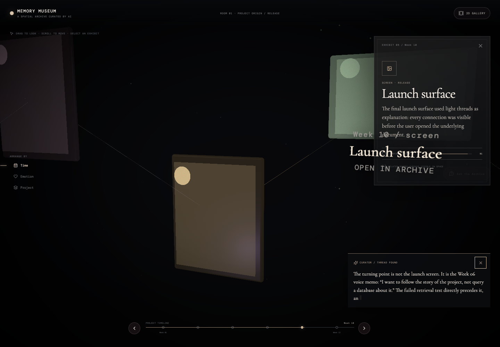
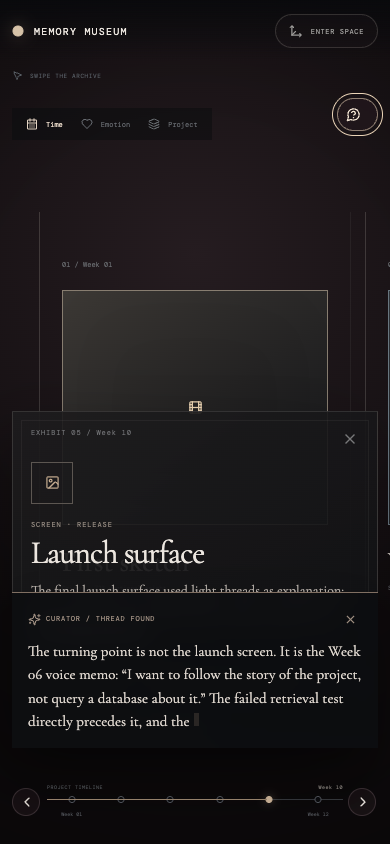

# AI Memory Museum

**A spatial archive curated by AI.** Walk through project documents, experiments, feedback, and retrospectives as an atmospheric exhibition instead of searching a folder.

## Art direction

Memory Museum is intentionally dreamlike and cinematic: full-screen spatial navigation, volumetric-feeling light, fog, dust, glowing document objects, and almost no conventional app chrome. The 2D fallback is a horizontal exhibition—not a dashboard grid.

## Core interactions

- CameraControls-based navigation through a full-screen React Three Fiber exhibition.
- Time, emotion, and project arrangements rebuild artifact positions in space.
- Light threads connect the project narrative.
- `Ask the Archive` moves to the pivotal memory and streams an AI curator interpretation.
- Selecting an exhibit opens a material/page-style reveal with emotional weight and provenance.
- Timeline scrubber moves through the project arc.
- Arrow keys provide guided exhibit navigation and Escape returns to the room.
- Mobile and WebGL-disabled environments use a purpose-built 2D gallery fallback.
- Low-power devices reduce DPR, particles and postprocessing; hidden tabs suspend the WebGL frameloop.

## Visual reference adoption

The required catalog is preserved verbatim at [`docs/visual-reference-catalog.md`](docs/visual-reference-catalog.md). Reference investigation, local comparisons, license verification and adoption decisions are documented in [`docs/reference-adoption.md`](docs/reference-adoption.md).

### Latest captures





## Run locally

```bash
corepack pnpm install
corepack pnpm dev
```

Open http://localhost:3104.

## Quality checks

```bash
corepack pnpm typecheck
corepack pnpm lint
corepack pnpm build
```

The application is fully self-contained and does not import code from the original monorepo or sibling projects.
