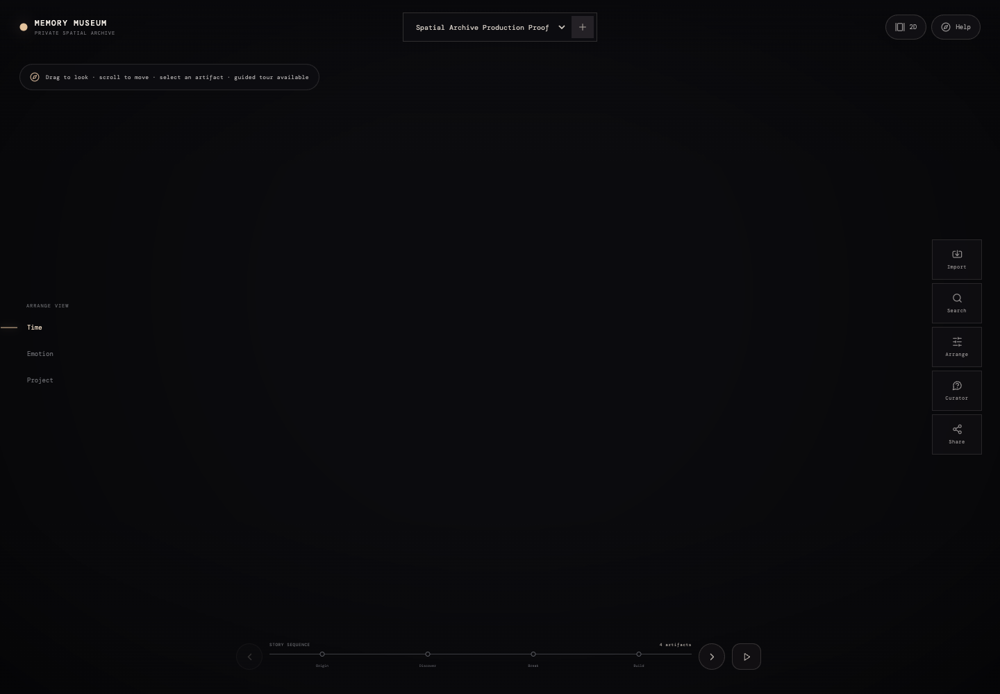
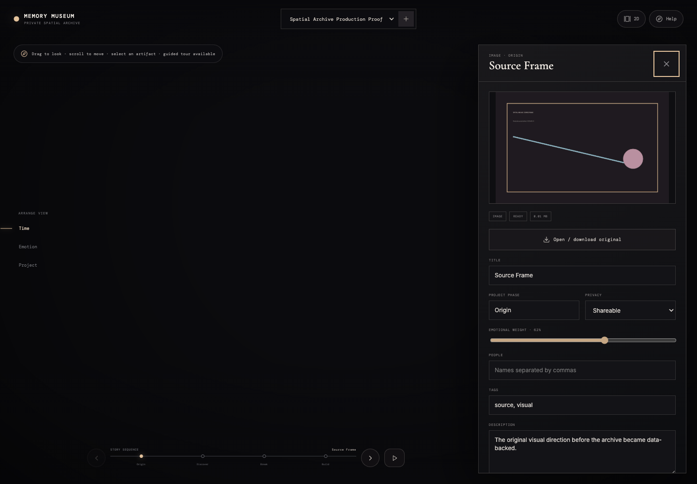
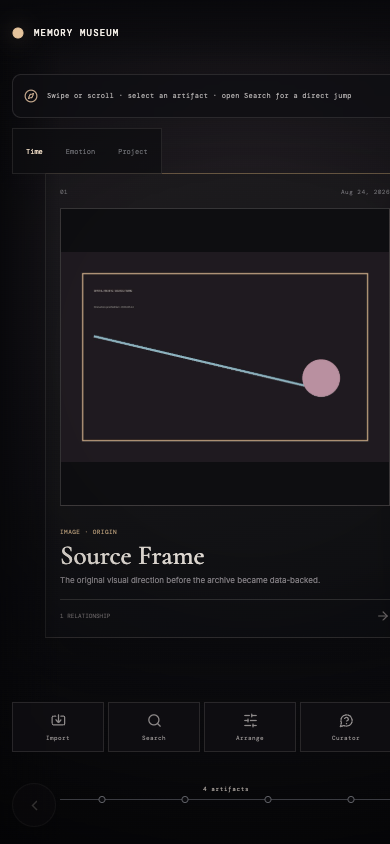
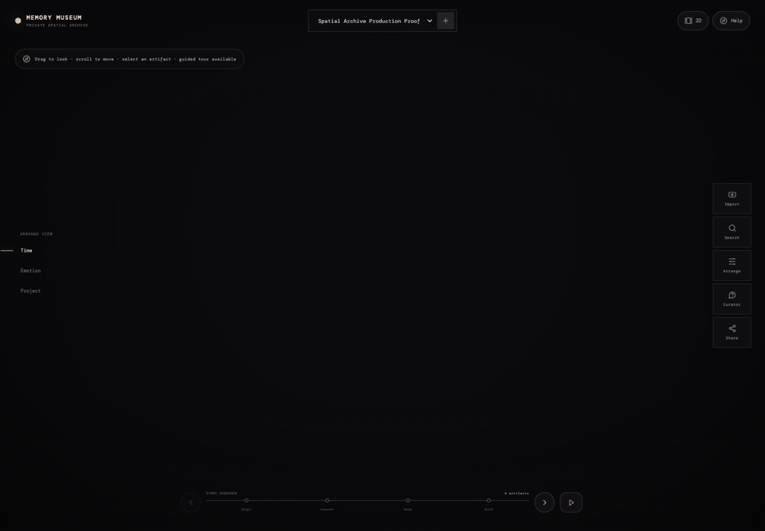

# AI Memory Museum

**A production-grade spatial archive for turning real project evidence into a navigable story.** Import images, PDFs, audio, notes and other source material, preserve provenance, arrange an exhibition, ask a citation-aware curator, and return to the same archive after refresh.

## Product flow

```text
Create archive
→ Import artifacts
→ Add metadata
→ Generate relationships
→ Arrange exhibition
→ Preview story
→ Ask curator
→ Edit interpretation
→ Share or export
```

The application deliberately keeps the dreamlike full-screen museum identity, but the archive now runs on persisted source files, metadata, relationships and authored spatial positions rather than mock objects.

## Production architecture

- React 18 + TypeScript + Vite application shell.
- React Three Fiber + Drei + react-postprocessing spatial exhibition.
- Purpose-built 2D gallery and floor-plan editor for mobile, accessibility and fallback use.
- FastAPI backend with PostgreSQL metadata storage.
- Alembic database migrations.
- MinIO S3-compatible object storage with short-lived signed media URLs.
- ffmpeg and Poppler derivative pipeline for audio/video/PDF previews.
- Deterministic curator fallback with validated artifact citations and an adapter boundary for external AI providers.

Detailed architecture and operating boundaries are documented in:

- [`docs/production-architecture.md`](docs/production-architecture.md)
- [`docs/archive-model.md`](docs/archive-model.md)
- [`docs/media-pipeline.md`](docs/media-pipeline.md)
- [`docs/spatial-navigation.md`](docs/spatial-navigation.md)
- [`docs/accessibility-model.md`](docs/accessibility-model.md)
- [`docs/privacy.md`](docs/privacy.md)
- [`docs/deployment.md`](docs/deployment.md)

## Real artifact support

The import flow supports:

- image
- PDF
- Markdown
- TXT
- audio
- allowed local video
- URL metadata
- manual notes

Artifacts preserve title, type, source, timestamps, project phase, emotion, people, tags, description, transcript, provenance, privacy state, SHA-256 file hash, derivatives, relationships, AI interpretation and human-authored interpretation.

The backend provides duplicate hash detection, recoverable processing state, media retry, delete/export and access-controlled media URLs.

## Exhibition authoring

The editor persists authored spatial positions and version history. Current controls include:

- position
- rotation
- scale
- room/zone
- relationship links
- story sequence
- lighting preset
- annotation
- camera stop
- undo / redo
- version save

The 2D floor-plan editor uses the same persisted spatial position model as the 3D exhibition.

## Navigation and accessibility

- Guided artifact stepping and free spatial exploration.
- Artifact deep links via archive URL + artifact query parameter.
- Keyboard timeline navigation and Escape handling.
- Reduced-motion camera transitions.
- Mobile defaults to the 2D gallery.
- One primary overlay at a time to prevent exhibit, curator and editor collisions.
- Mobile overlays are full-screen sheets with safe-area spacing, focus containment and focus restoration.
- WebGL context loss and unsupported WebGL fall back to the 2D experience.
- Low-power devices cap DPR and reduce atmospheric effects.
- Hidden tabs suspend the R3F render loop.

## AI Curator safety model

Curator outputs are separate from source memory and human notes. Citation IDs are validated against the loaded archive before display. The deterministic fallback returns an interpretation, cited artifacts, pivotal moment, contradiction, missing context and suggested route without changing original artifact content.

## Production captures

### Desktop spatial archive



### Artifact drawer and provenance



### Mobile 2D archive



### Cross-mode proof



The older `preview.png` and `preview-mobile.png` files are retained as the prototype baseline for visual comparison.


## Local development

### Full production-like stack

```bash
docker compose up -d --build
corepack pnpm install
corepack pnpm dev
```

Local services:

```text
Web:           http://localhost:3104
API:           http://localhost:8104
API health:    http://localhost:8104/api/health
MinIO API:     http://localhost:9004
MinIO console: http://localhost:9005
PostgreSQL:    localhost:54324
```

The Vite development server proxies `/api` to the FastAPI server.

## Quality checks

```bash
corepack pnpm typecheck
corepack pnpm lint
corepack pnpm test:domain
corepack pnpm build
backend/.venv/bin/python -m pytest backend/tests -q
```

Backend integration coverage exercises real image/PDF/audio processing, duplicate detection, metadata editing, relationships, spatial persistence, exhibition versions, curator citations, search, share privacy, export/revoke/delete and failed-processing retry.

## Performance

The large R3F spatial runtime is dynamically imported so the default/mobile 2D shell does not pay the complete 3D cost up front.

Current production build split at the latest validation:

```text
Application shell: ~217 KB minified / ~66 KB gzip
Spatial R3F chunk:  ~979 KB minified / ~260 KB gzip, lazy-loaded
CSS:                ~34 KB minified / ~8 KB gzip
```

## Visual reference adoption

The reference catalog is preserved at [`docs/visual-reference-catalog.md`](docs/visual-reference-catalog.md). Investigation, license verification and adoption decisions are tracked in [`docs/reference-adoption.md`](docs/reference-adoption.md) and [`CREDITS.md`](CREDITS.md).

## Privacy

Archives are private by default. Read-only share manifests exclude private artifacts and human-private notes, share links can be revoked, original media is served with expiring signed URLs, and archives can be exported or deleted. See [`docs/privacy.md`](docs/privacy.md) for the current local trust boundary and production authentication requirements.
